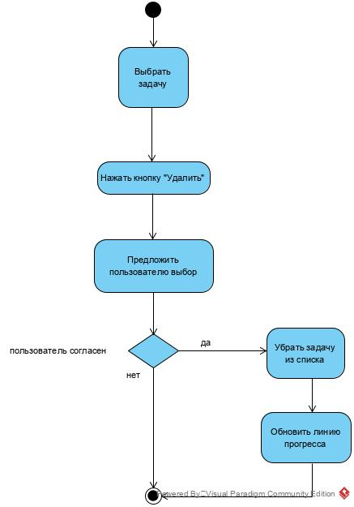
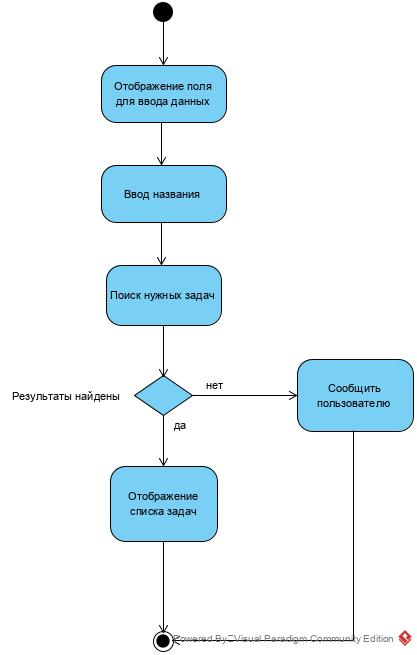

# Диаграммы активностей

# Содержание
1. [Добавить задачу](#1)  
2. [Удалить задачу](#2)  
3. [Найти задачу](#3)

<a name="1"/>

# 1. Добавить задачу 

<a name="2"/>

# 2. Удалить задачу

<a name="3"/>

# 3. Найти задачу

