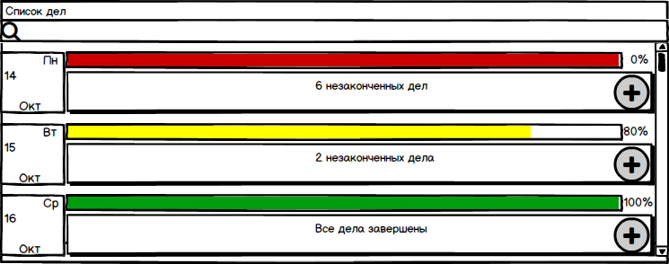
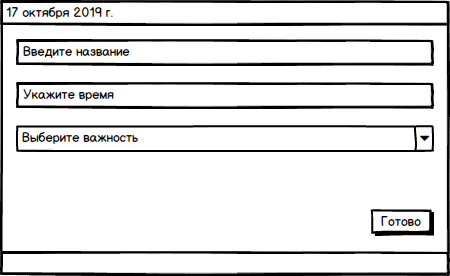
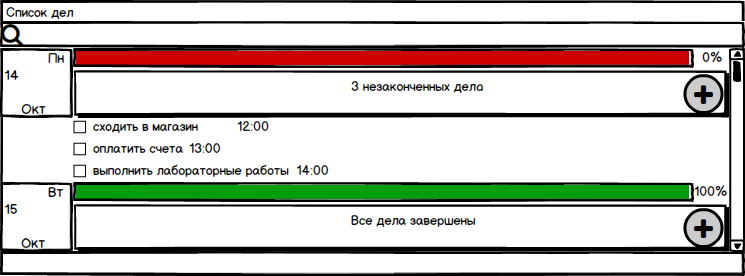

# Требования к проекту
##  Содержание
1. [Введение](#1)  
    1.1. [Назначение](#1.1)  
    1.2. [Исходные данные](#1.2)  
2. [Требования пользователя](#2)  
	2.1. [Программные интерфейсы](#2.1)  
	2.2. [Интерфейс пользователя](#2.2)  
	2.3. [Характеристики пользователей](#2.3)  	
3. [Системные требования](#3)  
	3.1 [Функциональные требования](#3.1)  
	3.2 [Нефункциональные требования](#3.2)  
	3.2.1 [Атрибуты качества](#3.2.1)  
	3.2.2 [Ограничения](#3.2.2)  
4. [Аналоги](#4)

## 1. Введение 
### 1.1. Назначение 

В этом документе описаны функциональные и нефункциональные требования к приложению «Список дел» для ОС Windows 10. Этот документ предназначен для команды, которая будет реализовывать и проверять корректность работы приложения.

### 1.2. Исходные данные 
Многие люди испытывают трудности при запоминании большого количества дел, которые они запланировали. Есть потребность в простом и удобном приложении, которое позволит облегчить данную задачу.

## 2. Требования пользователя 
### 2.1. Программные интерфейсы 
Присутствует интерфейс, написанный с использованием средств графической библиотеки JavaFX для связи графической оболочки с логической частью приложения. Для хранения данных будет использована СУБД Sqlite.

### 2.2. Интерфейс пользователя 
На экране будет присутствовать календарь, на котором можно будет просмотреть прогресс выполнения задач для определенного дня, кнопка "Плюс". Наличие кнопки "Поиск".
    
 
 
 При нажатии на кнопку "Плюс" появляется новое окно, где можно написать название задачи, выбрать приоритет, установить время.  
 
 
При нажатии на кнопку "Поиск" можно ввести названия задачи для поиска.    
При нажатии на определенный день, будет выпадать список запланированных дел. После этого можно отметить выполненные задачи, удалить некоторые из них.
 
 
### 2.3. Характеристики пользователей 
Целевая аудитория

Приложение будет полезно пользователям, которые испытывают трудности при запоминании большого количества задач и планировании своего рабочего дня.

## 3. Системные требования 

### 3.1. Функциональные требования 

Пользователю предоставлены следующие возможности:

| Функция | Требования | 
|:---|:---|
| Добавить новую задачу | Приложение должно предоставить пользователю возможность создать новую задачу |
| Редактирование задачи | Приложение должно предоставить пользователю возможность отредактировать новую задачу в соответствии со своими требованиями |
| Просмотр прогресса | Приложение должно отображать в удобном виде текущий прогресс выполнения плана |
| Отметка выполненных дел | Приложение должно предоставить пользователю возможность отметить выполненную задачу |
| Поиск дела | Приложение должно осуществлять поиск запрашиваемой задачи. Пользователь должен быть оповещен о результатах поиска |

### 3.2. Нефункциональные требования 

#### 3.2.1 Атрибуты качества 
Реализуется кроссплатформенность (запуск под разными платформами). Это позволит пользователям легко запускать приложение на разных платформах, тем самым не будет препятствовать росту аудитории.
Программа занимает очень мало места на жёстком диске и не требовательна к ресурсам ОС. 
#### 3.2.2 Ограничения 
Запуск приложения производится под любой операционной системой на которой установлен JVM. Реализаци приложения выполнена на Java 8 с использованием технологии JavaFX.

## 4. Аналоги 
Обзор аналогов представлен в документе [**Overview of analogues.md**](Overview%20of%20analogues.md)

